# greenwood-library-website

**CapStone Project: Enhancing A community Library Website**

**Background Scenario:** 

You're part of a development team tasked with enhancing he website for the "Greenwood Community Library." 

The website aims to be more engaging and informative for its visitors. It currently included basic sections:     
- Home 
- About Us 
- Events  
- Contact Us. 

Your team decides to add a __"Book Reviews"__ section and update the __"Events"__ page to feature upcoming community events. 

You will simulate the roles of two contributors "morgan" and "jamie". Morgan will focus on adding the "Book Reviews" section, while Jamie will update the"Events" page with new community events. 

__Objectives:__

- Practice cloning a repositroy and working with branches in Git.

- Gain experience in stagging, commiting, and pushing changes from both developers. 

- Create pull requests and merge them after resolving any potential conflicts. 

__Setup__

1. Create a Repository on Github: 
Name it greenwood-library-website.
Initialize it with a README.md file and clone it to your local machine.

__Tasks__ 

1. In the main branch, using VS Code editor, ensure there are files for each of the webpages. 

- home.html 
- about_us.html
- events.html 
- contact_us.html

2. Add any random content to each of the files. 

3. Stage, commit and push the changes directly to the main branch. (This is a simulation of the team's exisiting code base for the website)

__Morgan's work: Adding Book Reviews__
1. Create a Branch for Morgan:
2. switch to a new branch named add-book-reviews
3. Add a new file book_reviews.html to represent the Book reviews section:
4. Add a random text content to the file
5. Stage, Commit, and Push Changes with a message like "Add book reviews section."
6. Push the add-book-reviews branch to GitHub. 
7. Raise a PR for Morgan's work
8. Merge Morgan's work to the main branch. 

---

__Solution__

__Setup__

Repository with a README.md file

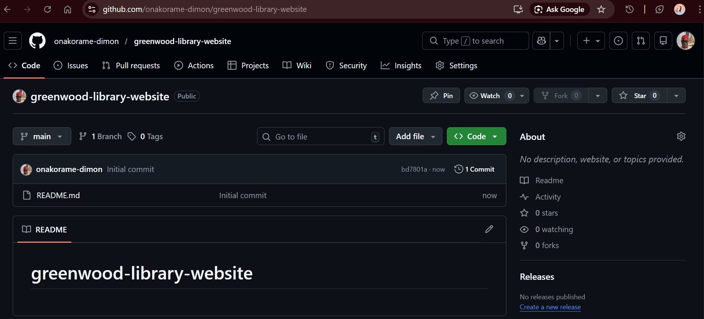

Clone remote repository to local repo.

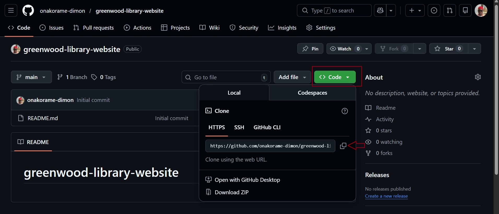

After copying the remote repo URL, use the `git clone` command to copy the remote repo to the local repo.

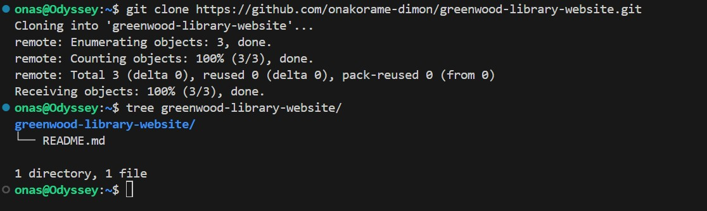

__Tasks__ 

__step 1 & 2__

Add files to VS code with contents

__step 3__

Stage, commit and push the changes directly to the main branch. (This is a simulation of the team's exisiting code base for the website)

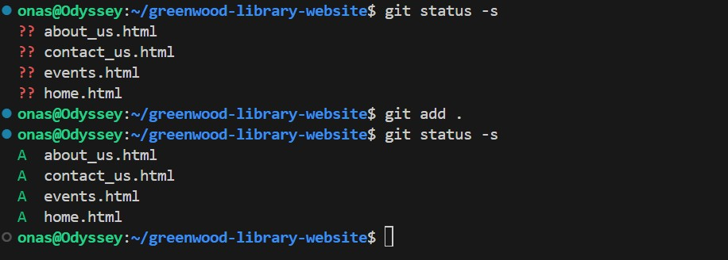

To stage the files, use the `git add .` command. 

TThe `.` argument enables us to stage all the files in the working directory at once. 

The `git status` command lets us see which files would be added to the staging area. 

The `??` shows that the files are untracked by git. 
The `AA` indicates that the files are newly tracked by git,  and added to the staging area. 

It is good practise to use the `git status` command to view the files that would be stagged before adding them to the staging area. 

After staging, the files can be commited to the local repository using the `git commit` command. 

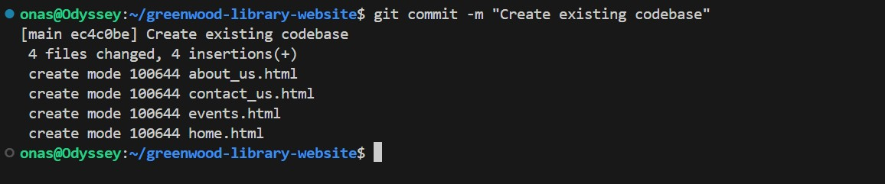

Pushing the files to the remote repository. 

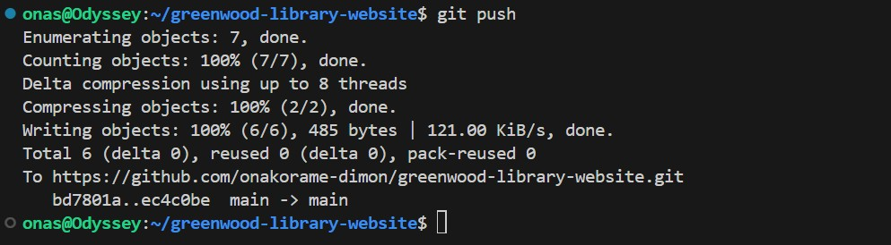

__Morgan's work: Adding Book Reviews__

#### Simulating Morgan's work:

__step 1 - 5__ 

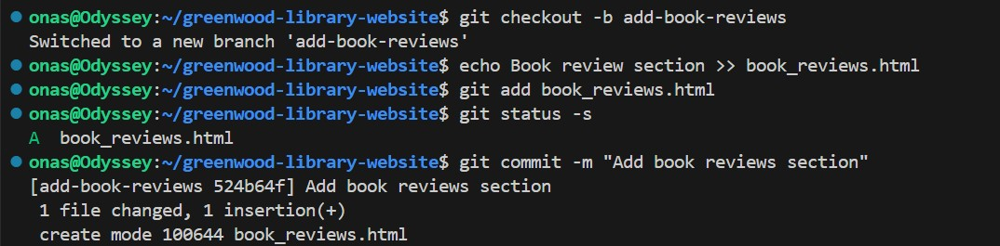 

The `git checkout -b add-book-reviews` command is used to create the branch and switch to the created branch. 

The `echo` command is used to create a file named "book_reviews.html, and to add the contents "Book review section" to the file. 

The `git add` command is used to stage the files while `git status -s` is used to view a summary of files that would be added to the index 

`git commit` is used to commit the changes to the repositroy. The `-m` argument allows us to specify a commit message.

__step 6__ 

Pushing the add-book-reviews branch to GitHub. 

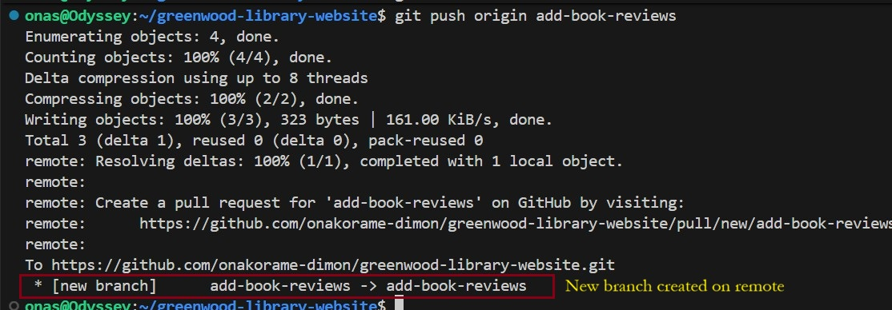

When you push a branch to the remote repository, if the branch does not exist it creates a new branch. 

>NOTE: `origin` is an alias for the remote repository URL.
>

__step 7__

Raise a PR for Morgan's work

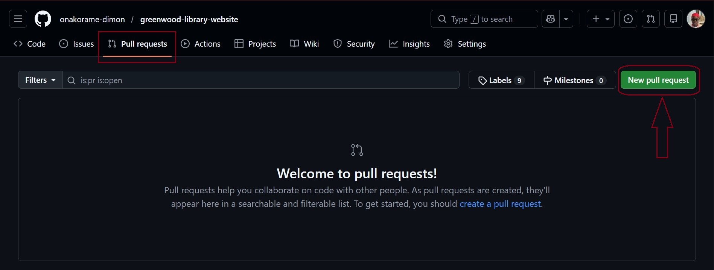

On the remote repository, Github in this case, switch to the Pul requests tab. Then click on the New pull request button. 

Next, toggle the `compare:main` switch to the add-book-reviews branch. 

Currently, the main branch is compared with the main, not with the add-book-section branch. Hence, why we see no chages.

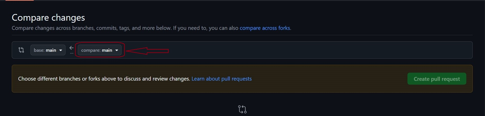

After switching, click on create pull request.

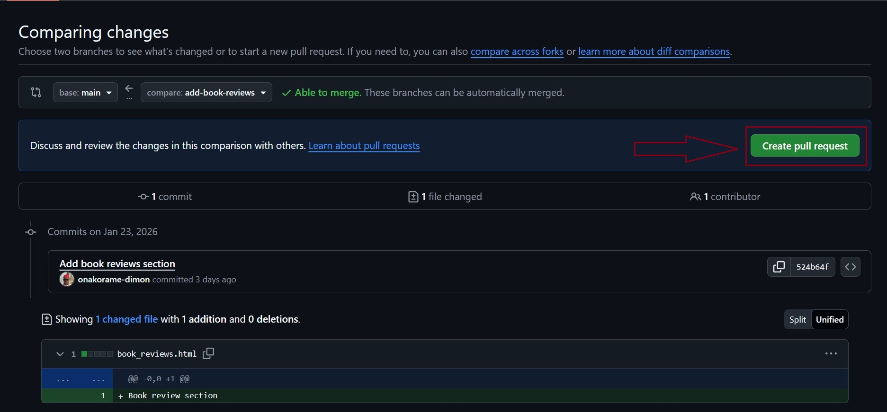

You can add a detailed description of the changes made and the reason for the pull request.

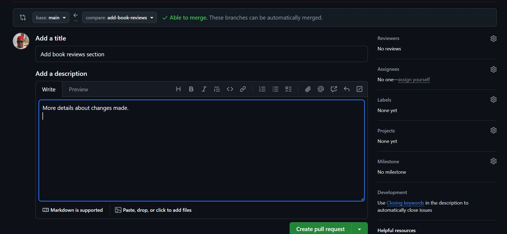

After you have writen a description of the Pull request, you can then create the pull request. 

__step 8__

Merge Pull request to the main branch.

To merge the changes to the main branch, click on the pull request tab to view open pull requests.

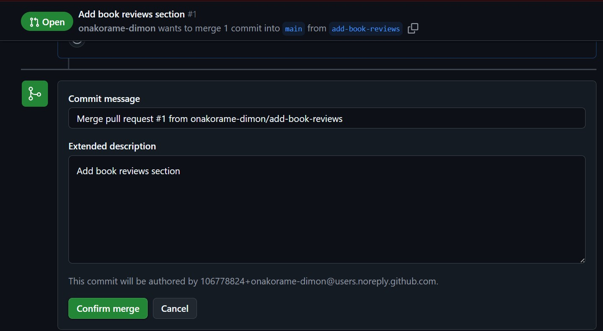

To complete the merge, add a commit message then click confirm merge.

This merges the changes from the add-book-reviews section branch to the main branch.

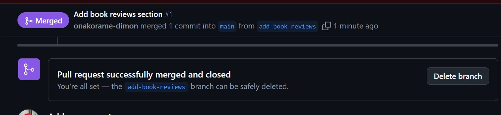

After the merge is successful, the Pull request is closed. Also, you can choose to delete the branch after the pull request is successful. 

__complete__